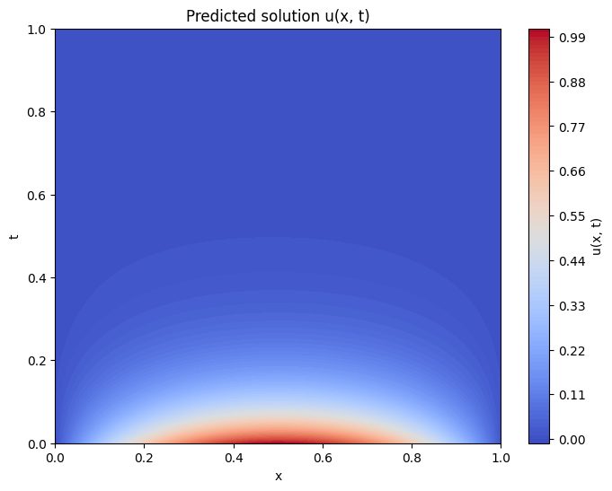
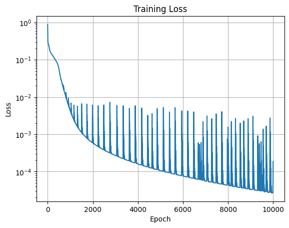
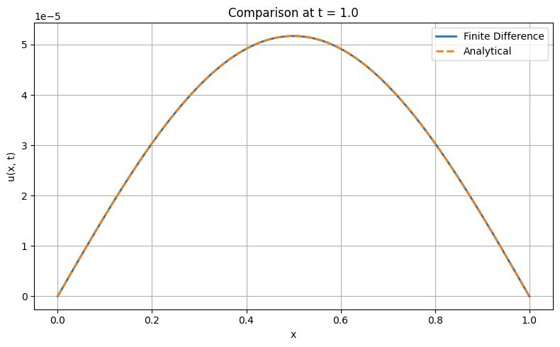

# 🔥 Physics-Informed Neural Network  — 1D Heat Equation

This project solves the 1D heat equation using two approaches:
1. **Physics-Informed Neural Networks (PINNs)** — a neural network that embeds the physics of the PDE into its training.
2. **Finite Difference Method (FDM)** — a traditional numerical method for solving PDEs.

---

## 📘 Problem Statement

We solve the 1D heat equation:

\[
\frac{\partial u}{\partial t} = \frac{\partial^2 u}{\partial x^2}, \quad x \in (0,1), \; t > 0
\]

with boundary conditions:
\[
u(0,t) = u(1,t) = 0
\]

and initial condition:
\[
u(x, 0) = \sin(\pi x)
\]

---

## 📷 Example Visuals

### 🔸 PINN Predicted Heatmap


### 🔸 Training Error 


### 🔸 Exact Solution


### 🔸 FDM vs Exact at t = 1



## 🧠 PINN Approach (TensorFlow)

The PINN:
- Approximates \( u(x, t) \) using a feedforward neural network.
- Minimizes a loss combining:
  - PDE residual (physics)
  - Initial condition error
  - Boundary condition error

### 🔧 Key Components
- `pinn_model.py`: defines the neural network and physics residual.
- `data_generator.py`: generates collocation, boundary, and initial condition points.
- `train.py`: trains the PINN using the Adam optimizer.

### 📊 Output
- Training loss curve
- Predicted solution heatmap
- Comparison against analytical solution
- Error visualization

---

## 🧮 FDM Approach (NumPy)

The finite difference solver:
- Uses an explicit Forward-Time Centered-Space (FTCS) method.
- Enforces stability via \( \alpha = \frac{\Delta t}{\Delta x^2} \leq 0.5 \).

### 🔧 Key Components
- `fdm_solver.py`: implements the FDM scheme.
- Plots solution at multiple time intervals.
- Compares with the exact analytical solution.

---

## 📂 Project Structure

```
PINNs-Heat-Equation/
│
├── src/
│   ├── pinn_model.py          # PINN architecture + residual computation
│   ├── data_generator.py      # IC, BC, and collocation point generation
│   ├── train.py               # Training script
│   └── fdm_solver.py          # Finite difference solver + plots
│
├── notebooks/                 # Optional: Jupyter notebook version
│
├── results/                   # Plots, comparisons, and saved outputs
│
├── requirements.txt
└── README.md
```

---

## ✅ How to Run

### Create virtual environment:
```bash
python -m venv venv
source venv/bin/activate  # or .\venv\Scripts\activate on Windows
pip install -r requirements.txt
```

### Train the PINN:
```bash
python src/train.py
```

### Run the FDM:
```bash
python src/fdm_solver.py
```

---

## 🧪 Comparison

- PINN captures the solution with good accuracy (~0.1% error).
- FDM is faster but requires careful tuning of the time step.
- PINNs generalize well and can handle inverse problems or irregular domains.

---


## 📚 References

- Raissi, M., Perdikaris, P., & Karniadakis, G. E. (2019). Physics-informed neural networks. *Journal of Computational Physics*.
- LeVeque, R. J. (2007). *Finite Difference Methods for Ordinary and Partial Differential Equations*.

---

## 👨‍🎓 Author

**Rahul K R** — M.Sc. Applied Mathematics  
*Building interpretable physics + ML projects for simulation and modeling*


## 📝 Extra Notes from PINN Development Process, quick recaps

- A PINN learns the solution to a differential equation by being penalized when it violates:
  - The PDE
  - The initial condition
  - The boundary condition

- We generate:
  - **Collocation points**: interior random points using `generate_collocation_points()`
  - **Boundary points**: vertically stacked rows with left/right conditions across time
  - **Initial condition**: solution at \( t = 0 \), typically \( \sin(\pi x) \)

- The `PINN` class inherits from `tf.keras.Model` to allow use of:
  - TensorFlow training loop integration
  - Clean definition of the architecture and forward pass

- `__init__` and `self` enable the network to store layers and properties across calls.

- Activation function: `tanh` is used because it is:
  - Zero-centered (range \([-1, 1]\))
  - Smooth, continuous, and helps gradients flow better than sigmoid

- `compute_pde_residual(self, X)` does:
  1. Predict \( u(x, t) \)
  2. Compute \( \frac{\partial u}{\partial x} \), \( \frac{\partial u}{\partial t} \)
  3. Then \( \frac{\partial^2 u}{\partial x^2} \)
  4. Returns residual \( f = u_t - u_{xx} \)

- **GradientTape in TensorFlow** records operations on tensors and applies the chain rule to compute gradients automatically.
- We use two tapes to compute first and second-order derivatives separately.
